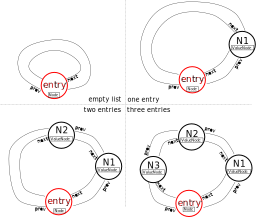

# ex31: Adding an iterator interface to a doubly-linked list

- **Hand out**: December 14, 9am
- **Hand in**: until January 9, 2024, end of day, via your git submission repo `ex31`
- Your solution to this exercise is the starting point in the 30min discussion session.
- Prepare yourself for a discussion on your solution.

## Overview

In this exercise you have to implement a standard library compatible, bidirectional iterator for the provided class template `List` in [`ex31/List.hpp`](ex31/List.hpp). 
Let's first have a short introduction on some details:

- The provided `List` is a fully functional doubly-linked list with public member functions to push elements at at front or at the back.
- It is a resource-owning class supporting move semantics so:  all five special member functions (*rule of 5*) are user-defined.
- The implementation (not exposed in the public interface) relies on a *entry node* which is always present (even in a newly constructed empty `List` object)
- The *entry node* serves as entry and connets the beginning and end of the list. 
- The *entry node* does not store any value.

The following image illustrates the state of a list 

- in empty state (top left), 
- storing a single element (top right), 
- storing two elements (bottom left), and 
- storing three elements (bottom right).



Let's have a look at the anatomy of the implementation:

```cpp
template <class T> class List {
private:
  struct Node {
    Node* prev; ///< pointer to previous node in list
    Node* next; ///< pointer to next node in list
  };

  struct ValueNode : Node {
    T value;
  };

  Node* entry;    ///< entry node (always present)
  size_type size; ///< current number of nodes (excluding the entry node)

public:

  void clear();
  void push_back(const value_type& value);
  void push_front(const value_type& value);
  List();
  List(const List& other);
  List(List&& other);
  List& operator=(const List& other);
  List& operator=(List&& other);
  ~List();

  /// \todo Implement iterator interface

};
```

**Private nested types:** 

- The nested class types `Node` and `ValueNode` are never exposed to the user.
- The `Node` class is the base class and holds two pointers (`prev` and `next`) to bidirectionally navigate to the neighbouring nodes in the list.
- The `ValueNode` class inherits from the `Node` class and adds an additional member `value` to store an element.

**Private members:** 

- The list stores the current size of the list in its data member `size` which is `0` for an empty list.
- The *entry node* `entry` is allocated and initialized when a `List` object is created (via one of the constructors of the class).
- If the list is empty, `prev` and `next` of `entry` point to itself.

## Task Details: Requirements towards the iterator interface

To guide you through the requirements towards the iterator interface these tests are provided:

- **testA**: checks if an iterator obtained via `list.begin()` results in a reference to a element stored in the list.
- **testB**: checks if the increment `++it` and decrement `--it` results again in an iterator providing access to the expected element.
- **testC**: checks if an iterator obtained via `list.end()` provides access the last element in a list if it is deceremented once via `--it`.
- **testD**: checks if *member-of-pointer* access is possible via the iterator, i.e. if `it->member` provides read and write access to the respective `member` of an element in the list. 
- **testE**: checks if the comparison of iterators is enabled via `!=` and `==` operators
- **testF**: checks if the iterators work for
  - explicit for loops `for (auto it = list.begin(); it != list.end(); ++it)`
  - range-based for loops `for (const auto& item : list)`
  - while loops `while (it != list.end())`
- **testG**: checks if iterators obtained from `List` objects providing `const` access only also provide only `const` access. Additionally `cbegin()` and `cend()` should also only provide const access. Further it is checked if the nested types for the respective iterators `List::iterator` and `List::const_iterator` are available.
- **testH**: checks if the bidirectional iterator can be used in the context of functionality and algorithms from the stdlib and provides the expected nested types [cppref](https://en.cppreference.com/w/cpp/iterator/iterator_traits).

## Project Layout

```
.
├── README.md               # this file
├── CMakeLists.txt          # top-level configuration of the project
├── ex31                    # sources
│   ├── CMakeLists.txt      # configuration w.r.t to sources in this folder
│   ├── List.hpp            # doubly-linked list with iters
│   ├── List.testA.cpp      # testing functionality 
│   :                           
│   └── List.testH.cpp      # ...
├── doxygen                 # doxygen configuration
│   ├── CMakeLists.txt      
│   └── doxygen-awesome.css
├── .clang-format           # format style for c++ source code
├── .expected-files         # list of files considered for testing your submission
├── .tests                  # list of tests performed on your submission
├── .gitignore              # file patterns to be ignored by git by default when committing
└── .git                    # internal git bookkeeping
```

# Generate config, build, run, and test using CMake/CTest

Final sequence of commands before submitting:
```shell
cd home/of/repo/of/ex31
rm -rf build
cmake -S . -B build -D CMAKE_BUILD_TYPE=Debug   # generate into 'build' folder
cmake --build build --target all                # build all targets
ctest --test-dir build                          # run all tests
```

